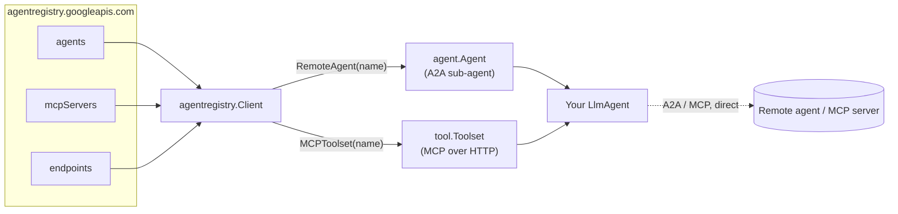

# Agent Registry examples

Runnable samples for the **Google Cloud Agent Registry** client (`google.golang.org/adk/v2/agentregistry`) — a governed catalog of A2A agents, MCP servers, and model endpoints. One browses the catalog, one builds an agent out of what it finds, one publishes an agent and reaches it back through the catalog.

Every example has its own README with a Mermaid diagram, a goal, run instructions, and an example session.

## Prerequisites

All three samples talk to the real `agentregistry.googleapis.com`. You need:

- a project with the Agent Registry API enabled,
- `roles/agentregistry.viewer` on it — enough for `discover` and `bind`; `a2a` also registers a `Service`, so it needs create and delete permission on top. Without the read role every call fails with `403 PERMISSION_DENIED`,
- Application Default Credentials.

```bash
gcloud services enable agentregistry.googleapis.com --project=your-project --billing-project=your-project
gcloud auth application-default login
export GOOGLE_CLOUD_PROJECT=your-project
```

You probably don't have to register anything to try the samples: enabling a supported Google Cloud API auto-registers its **remote MCP server** in your registry. A fresh project typically already lists `run.googleapis.com`, `logging.googleapis.com`, `compute.googleapis.com`, and friends — all of which `bind` can consume as-is.

The client authenticates with ADC and bills the quota project (`GOOGLE_CLOUD_QUOTA_PROJECT`, then the credentials' `quota_project_id` on the ADC path, then `Config.ProjectID` — which these samples take from `GOOGLE_CLOUD_PROJECT`). `gcloud` picks its quota project separately, so pass `--billing-project` to it or an unrelated default can deny the call with `USER_PROJECT_DENIED`.

To see what is registered without running any Go code:

```bash
gcloud agent-registry agents list      --location=global --project=$GOOGLE_CLOUD_PROJECT --billing-project=$GOOGLE_CLOUD_PROJECT
gcloud agent-registry mcp-servers list --location=global --project=$GOOGLE_CLOUD_PROJECT --billing-project=$GOOGLE_CLOUD_PROJECT
```

Reference: [Agent Registry overview](https://docs.cloud.google.com/agent-registry/overview) — [set up](https://docs.cloud.google.com/agent-registry/setup), [manage agents](https://docs.cloud.google.com/agent-registry/manage-agents), [manage MCP servers and tools](https://docs.cloud.google.com/agent-registry/manage-mcp-tools).

### If you get `403 PERMISSION_DENIED`

Check which project you are actually hitting — `echo $GOOGLE_CLOUD_PROJECT`. A shell profile or a previous `gcloud config set` often leaves a default pointing at a project without the API enabled or without the viewer role, and the resource in the error names the project the call actually went to:

```text
Failed to list agents: HTTP 403 — PERMISSION_DENIED: Permission 'agentregistry.agents.list'
denied on resource '//agentregistry.googleapis.com/projects/some-other-project/locations/global'
Grant roles/agentregistry.viewer on this project, or point GOOGLE_CLOUD_PROJECT at one where you have it.
```

The message names the exact permission and resource; either grant it or set `GOOGLE_CLOUD_PROJECT` for the run. All three samples condense the API's error envelope like this by unwrapping `*agentregistry.APIError` — see `explain` in any `main.go`.

## Examples

| Example | What it demonstrates | LLM? |
|---|---|---|
| [`discover`](./discover) | Browse the catalog: `AllAgents` / `AllMCPServers` / `AllEndpoints` with a server-side filter and automatic paging | No |
| [`bind`](./bind) | Bind an agent to a *capability*: find the MCP server that declares the tool you need, then `MCPToolset` it | Yes |
| [`a2a`](./a2a) | Publish an agent of your own, resolve it back with `RemoteAgent`, and talk to it over A2A | No |

Start with `discover` to see what your project has; `bind` then needs no resource names at all. `a2a` is the only one that registers anything, and it is the only place `RemoteAgent` is exercised.

## How the pieces fit



The dotted line is the point of the whole thing: **the registry is a catalog, never a proxy.** It hands you a card and a URL; the traffic then goes straight from your process to the remote endpoint.

## Registering your own agent

The registry's write surface is the `Service` resource. You create a `Service`; the registry *projects* read-only `Agent` and `McpServer` resources from it — those are what the client reads, and they carry generated IDs like `agentregistry-00000000-0000-0000-630f-070a9d06e171`, not the ID you chose, so read the projected name back with `services describe --format='value(registryResource)'`.

The [`a2a`](./a2a) sample walks the whole loop with a working card, and its notes cover the traps that cost the most time: `a2a-agent-card` versus `no-spec`, the non-empty `skills` requirement, and keeping the card's `protocolBinding` in step with the handler you serve. Registering is also the one thing here that needs more than the viewer role.

## Core concepts at a glance

- **Client** — `agentregistry.New(ctx, Config{ProjectID, Location})`; pass `Config.HTTPClient` to supply your own (pre-authenticated) transport instead of ADC.
- **Discovery** — each collection has three methods: `List*` (one page), `Get*` (one resource by full name), and `All*` (an `iter.Seq2` that pages on demand and yields a single `(nil, err)` if a page fetch fails).
- **List options** — `WithFilter`, `WithPageSize`, `WithPageToken`; `All*` manages the page token itself.
- **Factory helpers** — `Client.RemoteAgent` resolves an agent record (embedded A2A card, else synthesized from its protocols) into an `agent.Agent`; `Client.MCPToolset` resolves an MCP server record into a `tool.Toolset`.
- **Egress auth is separate from registry auth.** `MCPToolset` reuses the registry's ADC client for `*.googleapis.com` endpoints; `RemoteAgent` never authenticates for you — pass `WithA2AHTTPClient` / `WithA2AHeaders` (or `WithMCPHTTPClient` / `WithMCPHeaders`) for anything else.
- **Errors** — a non-2xx response comes back as `*agentregistry.APIError` with `StatusCode` and `Body`.
