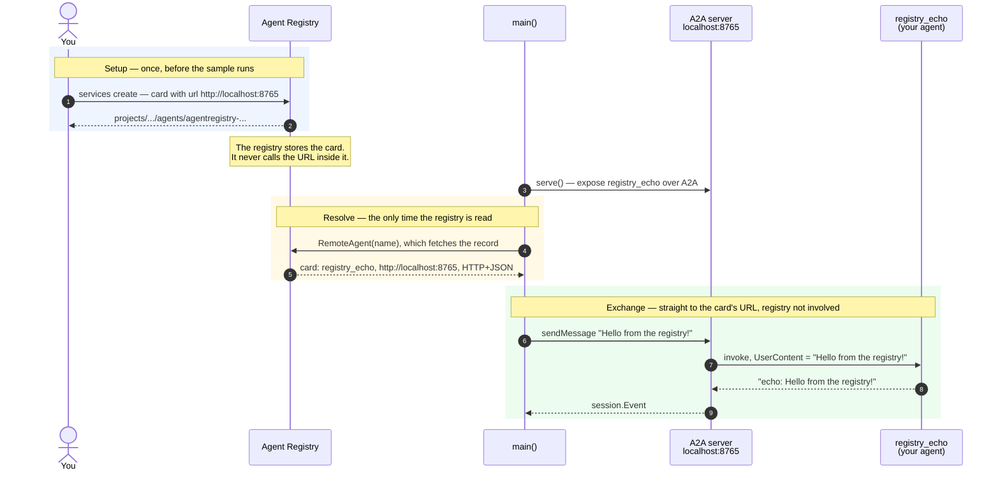

# Publishing an agent and reaching it through the registry

Register an agent of your own, then resolve it back out of the catalog and talk to it over A2A. This is the other factory helper: [`bind`](../bind) covers `MCPToolset`, this covers `Client.RemoteAgent`.

- **Concept:** the registry hands you a card and a URL; the A2A conversation is yours alone.
- **Needs LLM?** No — the published agent is a canned echo, so all you need is ADC.
- **Needs a registry?** Yes, plus a one-time registration — see [Setup](#setup).

## Goal

Show the fact that surprises people first: **the registry is a catalog, not a proxy.** It stores your agent card and never calls the URL inside it. So the card can point at `http://localhost:8765`, and the loop closes with nothing deployed — no Cloud Run service, no tunnel, no public endpoint.

The sample plays both roles in one process so it runs in one terminal:

- as **publisher** it serves an agent over A2A at that address,
- as **consumer** it knows only a registry resource name, and gets the URL, the transport, and the agent's identity from the catalog.

In production these are separate programs. The consuming code is unchanged — it is what any caller writes; the publishing code is what the agent's owner deploys.

## Workflow



`main()` appears once because it is one process: step 3 is it publishing, steps 4-9 are it consuming. And `registry_echo` is the same agent seen twice — the name this process serves under, and the name that comes back out of the catalog at resolve time. The message text is what makes the loop legible: it leaves `main()`, reaches your `agent.New` as `UserContent`, and comes back prefixed.

## Setup

Register the agent once. The card's `url` must match where the sample serves, and its `protocolBinding` must match the handler the sample uses (`HTTP+JSON` ↔ `a2asrv.NewRESTHandler`).

```bash
export GOOGLE_CLOUD_PROJECT=your-project

cat > /tmp/card.json <<'EOF'
{
  "name": "registry_echo",
  "description": "Echo agent published from a local process.",
  "version": "1.0.0",
  "supportedInterfaces": [
    { "url": "http://localhost:8765", "protocolBinding": "HTTP+JSON", "protocolVersion": "1.0" }
  ],
  "capabilities": { "streaming": true },
  "defaultInputModes": ["text/plain"],
  "defaultOutputModes": ["text/plain"],
  "skills": [
    { "id": "echo", "name": "Echo", "description": "Repeats the message back.", "tags": ["demo"] }
  ]
}
EOF

gcloud agent-registry services create adk-a2a-demo \
  --location=global --project=$GOOGLE_CLOUD_PROJECT --billing-project=$GOOGLE_CLOUD_PROJECT \
  --display-name="ADK A2A sample" \
  --agent-spec-type=a2a-agent-card \
  --agent-spec-content=@/tmp/card.json
```

The `Service` you created projects a read-only `Agent`, and that projection is what the client reads. Ask for its name:

```bash
export REGISTRY_AGENT=$(gcloud agent-registry services describe adk-a2a-demo \
  --location=global --project=$GOOGLE_CLOUD_PROJECT --billing-project=$GOOGLE_CLOUD_PROJECT \
  --format='value(registryResource)')
```

That prints the name in project-number form; the client accepts either that or the project-ID form.

## Running the sample

```bash
export GOOGLE_CLOUD_LOCATION=global
go run ./examples/agentregistry/a2a/
```

| Variable | Required | Meaning |
|---|---|---|
| `GOOGLE_CLOUD_PROJECT` | yes | Project whose registry is read |
| `GOOGLE_CLOUD_LOCATION` | no | Registry location, defaults to `global` |
| `REGISTRY_AGENT` | yes | Resource name of the projected agent |
| `A2A_ADDR` | no | Where to serve, defaults to `localhost:8765`; must match the card |

## Example session

```text
Serving an agent over A2A at http://localhost:8765
Resolved "registry_echo" from the registry; the URL and transport came from its card

>>> Hello from the registry!

<<< echo: Hello from the registry!
```

`registry_echo` is the name from the **card**, not from the local `agent.New` — proof the identity came out of the catalog. The reply carries the request text back, so both directions of the exchange are covered.

## Cleaning up

```bash
gcloud agent-registry services delete adk-a2a-demo \
  --location=global --project=$GOOGLE_CLOUD_PROJECT --billing-project=$GOOGLE_CLOUD_PROJECT
```

Deleting the `Service` removes the projected agent from the catalog.

## Notes

- **`--agent-spec-type=a2a-agent-card`, not `no-spec`.** `RemoteAgent` looks for a protocol of type `A2A_AGENT`; `no-spec` registers a `CUSTOM` one, and resolution fails with `A2A connection URI not found`.
- **`skills` must be non-empty**, each with `id`/`name`/`description`/`tags`, or the create call is rejected.
- **Egress auth is yours.** Nothing here needs it because localhost is not behind IAM. A published agent that is behind IAM needs `WithA2AHTTPClient` — and the right scopes for *that* agent, which are not always `cloud-platform`.
- **A failed A2A call is quiet.** It arrives as an event with `LLMResponse.ErrorMessage` set and no content, which reads as an empty answer if you only look at content; `ask` checks for it explicitly.
- **No embedded card? Still fine.** When a record has no `A2A_AGENT_CARD`, `RemoteAgent` synthesizes one from the record's protocols. Both paths end in the same `agent.Agent`.
