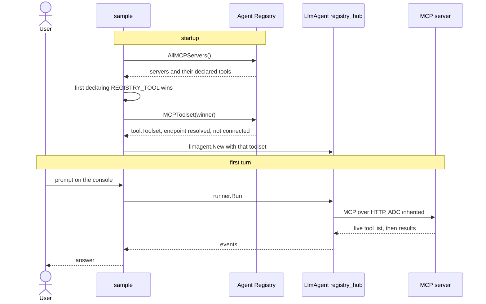

# Binding an agent to a capability

Build a running `LlmAgent` without knowing a single endpoint. You name the **tool you need**; the registry decides which MCP server provides it, and the sample resolves that server into a toolset at startup.

- **Concept:** search the catalog's tool metadata, then `Client.MCPToolset` the winner.
- **Needs LLM?** Yes
- **Needs a registry?** Yes — see [Prerequisites](../README.md#prerequisites).

## Goal

Show the registry doing something a config file cannot. Binding by resource name would be a wash — `MCPToolset(ctx, "projects/.../mcpServers/xyz")` is no better than pasting the endpoint URL into `mcptoolset.New`. Binding by **capability** is different: the answer depends on what is registered in this project right now, and it is computed from catalog metadata without connecting to a single candidate.

Two facts about real catalogs fall out of that, and the sample handles both:

- **A capability may have no provider.** Then there is nothing to bind and the sample says so.
- **A capability may have several.** Tool names are not unique across servers — in a stock project both `run.googleapis.com` and `agentregistry.googleapis.com` declare `list_services`, meaning entirely different things. The sample takes the first and names the others rather than guessing silently. Choosing between them is policy (a trusted publisher, an allowlist), so it belongs in your application, not here — and a generic tool name is the real smell.

Egress auth stays free along the way: an MCP server on `*.googleapis.com` inherits the credentials the registry client already holds, so nothing in this sample builds an OAuth client.

## Workflow



1. Scan the catalog for every server whose declared `Tools` include the wanted name.
2. Take the first, logging any others so a surprising pick is visible.
3. `MCPToolset` the winner, hand it to `llmagent.New`, serve through the launcher. That resolves the endpoint; the MCP session opens on the first model turn.

The live tool set comes from the MCP server itself once connected — the catalog metadata can lag behind it, and is only used to *choose*.

## Running the sample

```bash
export GOOGLE_CLOUD_PROJECT=your-project

# Model credentials: a Gemini API key...
export GOOGLE_API_KEY=...
# ...or Vertex AI, which needs a region. Set GOOGLE_CLOUD_REGION rather than
# GOOGLE_CLOUD_LOCATION: genai falls back to it, and the registry never reads
# it, so the catalog lookup stays in `global`.
export GOOGLE_GENAI_USE_VERTEXAI=true
export GOOGLE_CLOUD_REGION=us-central1

go run ./examples/agentregistry/bind/ console
```

No resource names to paste: the default capability is `list_log_names`, which any project with the Cloud Logging API enabled already provides, and which reads rather than writes.

| Variable | Required | Meaning |
|---|---|---|
| `GOOGLE_CLOUD_PROJECT` | yes | Project whose registry is searched |
| `GOOGLE_API_KEY` | yes, unless using Vertex AI | Gemini API key for the model |
| `GOOGLE_GENAI_USE_VERTEXAI` | no | `1`/`true` uses Vertex AI instead of an API key |
| `GOOGLE_CLOUD_REGION` | no | Vertex AI region; genai reads it, the registry does not |
| `GOOGLE_CLOUD_LOCATION` | no | Registry location, defaults to `global` — **genai reads it too**, and it wins over `GOOGLE_CLOUD_REGION`, so a regional value moves the catalog lookup as well |
| `REGISTRY_TOOL` | no | Capability to look for, defaults to `list_log_names` |

`console` is the default; the launcher also serves `web api`, `web a2a` and `web webui`. An unrecognised argument prints the full command-line syntax.

## Example session

Real output from a project with the Cloud Logging API enabled, abridged in the middle. The default capability resolves to one provider, and the tools it brings are then callable. Your logs will differ; which tools answered is the part that does not:

```text
$ go run ./examples/agentregistry/bind/ console
Tool "list_log_names" is provided by "logging.googleapis.com" (projects/my-project/locations/global/mcpServers/agentregistry-00000000-0000-0000-079a-e59aa1097d4d)

User -> In project my-project: list the kinds of logs and the log buckets, one line each, no extra detail. Say which tools you used.
Agent -> Kinds of logs:
         projects/my-project/logs/cloudaudit.googleapis.com%2Factivity
         projects/my-project/logs/cloudaudit.googleapis.com%2Fdata_access
         ...
         Log buckets:
         projects/my-project/locations/global/buckets/_Default
         projects/my-project/locations/global/buckets/_Required
         Tools used:
         list_log_names
         list_buckets
```

Both halves of the claim are in that one answer. `list_log_names` is the capability we asked for, so binding by capability did what it says. `list_buckets` appears nowhere in the code or the environment — it came along because you bind a *provider*, and get everything it serves. Name the project in the prompt: a smaller model will otherwise leave it out of the tool call and the API rejects it.

Ask for a generic capability and the ambiguity is reported rather than hidden:

```text
$ REGISTRY_TOOL=list_services go run ./examples/agentregistry/bind/ console
"list_services" is also declared by run.googleapis.com
Tool "list_services" is provided by "agentregistry.googleapis.com" (projects/my-project/locations/global/mcpServers/agentregistry-00000000-0000-0000-7ea4-5846298719d4)
```

Ask for one nobody provides, and you find out before an agent exists. The message
names the location it searched, because that is the other way this fails — a
`GOOGLE_CLOUD_LOCATION` meant for the model points the catalog somewhere empty:

```text
$ REGISTRY_TOOL=send_carrier_pigeon go run ./examples/agentregistry/bind/ console
Failed to find a provider for "send_carrier_pigeon" in projects/my-project/locations/global:
no registered MCP server declares this tool; run the discover sample to see what is available
```

At no point does the sample contain an endpoint URL, a tool schema, or a token.

## Notes

- **The scan reads the whole catalog.** `AllMCPServers` pages on demand, and the sample drains it so it can report every provider rather than the first one it trips over. Narrow it with `WithFilter` if your catalog is large enough for that to matter.
- **Don't set `http.Client.Timeout` on an egress client.** It is a deadline over the whole request and would truncate a streaming response; bound the `Transport` instead.
- **Resolution happens once, at startup.** A provider that changes in the registry is picked up on the next run, not mid-session.
- **A2A agents work the same way** via `Client.RemoteAgent`, but their egress is never authenticated for you — see [the index](../README.md#core-concepts-at-a-glance).
