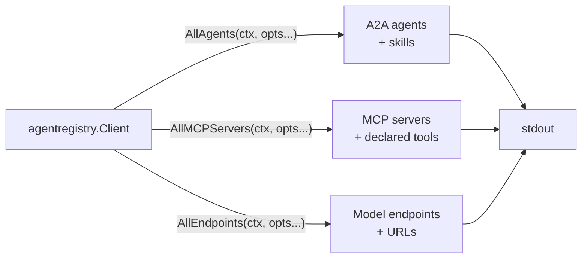

# Discovering the registry catalog

Print everything a project has published to the Google Cloud Agent Registry: A2A agents, MCP servers, and model endpoints. This is the sample to run first — it shows what your project actually has, and the tool names it prints are the capabilities [`bind`](../bind) can look for.

- **Concept:** Page through a collection with `Client.All*`, narrow it server-side with `WithFilter`.
- **Needs LLM?** No
- **Needs a registry?** Yes — see [Prerequisites](../README.md#prerequisites).

## Goal

Show the read side of the client. All three collections have the same three-method shape, and the sample uses the same code path for each:

- `List*` — one page, plus a `NextPageToken` you manage yourself.
- `Get*` — one resource, by full resource name.
- `All*` — an `iter.Seq2[*T, error]` that fetches the next page when the current one runs out.

## What it does



Each iterator is drained by the same generic `printAll` helper: it prints the display name, the full resource name, and a one-line detail. A failed page fetch surfaces as a single `(nil, err)` from the iterator, which ends the listing.

## Running the sample

```bash
export GOOGLE_CLOUD_PROJECT=your-project

go run ./examples/agentregistry/discover/
```

Optionally narrow the results with a server-side filter. `=` is an exact match and `:` a substring match:

```bash
REGISTRY_FILTER='displayName="Workspace Agent"' go run ./examples/agentregistry/discover/
REGISTRY_FILTER='displayName:Workspace'         go run ./examples/agentregistry/discover/
```

**Quote string values with double quotes.** The API accepts a single-quoted value like `displayName='Workspace Agent'` without complaint and then matches nothing — you get an empty catalog rather than an error. The `gcloud --filter=` examples in the Cloud docs use single quotes because `gcloud` re-parses the expression; the value forwarded to the API does not get that treatment.

| Variable | Required | Meaning |
|---|---|---|
| `GOOGLE_CLOUD_PROJECT` | yes | Project whose registry is listed |
| `GOOGLE_CLOUD_LOCATION` | no | Registry location, defaults to `global` |
| `REGISTRY_FILTER` | no | Filter expression applied to every collection |

## Example session

Real output from a project with the Agent Registry API enabled, abridged in the middle:

```text
Catalog of projects/my-project/locations/global

A2A agents:
  Workspace Agent
    projects/my-project/locations/global/agents/agentregistry-00000000-0000-0000-630f-070a9d06e171
    skills (1): create_presentation

MCP servers:
  agentregistry.googleapis.com
    projects/my-project/locations/global/mcpServers/agentregistry-00000000-0000-0000-7ea4-5846298719d4
    tools (20): list_agents, search_agents, get_agent, list_endpoints, get_endpoint, list_mcp_servers, search_mcp_servers, get_mcp_server, ...
  cloudtrace.googleapis.com
    projects/my-project/locations/global/mcpServers/agentregistry-00000000-0000-0000-5b2d-8ca8b7e9e6ce
    tools (2): list_traces, get_trace
  compute.googleapis.com
    projects/my-project/locations/global/mcpServers/agentregistry-00000000-0000-0000-ca16-4f9093e25ceb
    tools (29): create_instance, delete_instance, start_instance, stop_instance, reset_instance, get_instance_basic_info, set_instance_machine_type, list_instance_attached_disks, ...
  run.googleapis.com
    projects/my-project/locations/global/mcpServers/agentregistry-00000000-0000-0000-76f4-702f82fb93ff
    tools (5): get_service, list_services, deploy_service_from_image, deploy_service_from_archive, deploy_service_from_file_contents

Model endpoints:
  (none)
```

Nothing above was registered by hand: the MCP servers appeared because the matching Google Cloud APIs are enabled, and `Workspace Agent` is Google-managed. An empty collection prints `(none)`, which is a healthy response rather than an error.

A failure is a typed `*agentregistry.APIError`; `explain` unwraps it so a denial reads as one actionable line instead of the API's JSON envelope — see [If you get 403](../README.md#if-you-get-403-permission_denied).

## Notes

- **Resource IDs are generated, not chosen.** You register a `Service`; the registry projects `Agent`/`McpServer` resources with IDs like `agentregistry-00000000-0000-0000-...`. Copy the whole resource name out of this output rather than trying to construct it.
- **Paging is per round trip.** `WithPageSize(10)` bounds one request, not the total; `All*` keeps requesting until the registry stops returning a page token. Use `ListAgents` directly if you want to own the token.
- **The filter runs server-side.** It is forwarded verbatim to the API as the `filter` query parameter, so it is neither validated nor rewritten on the way out — a malformed expression usually reads as "no matches".
- **`Tools` on an MCP server is registry metadata.** It is what was uploaded with the server spec; the live tool set is whatever the server reports over MCP once [`bind`](../bind) connects to it.
